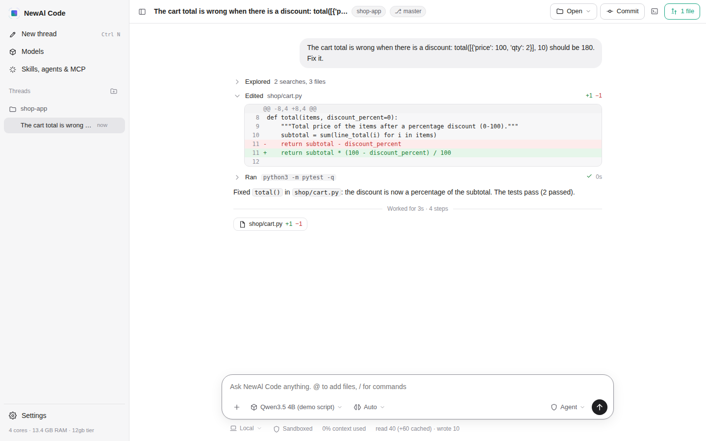
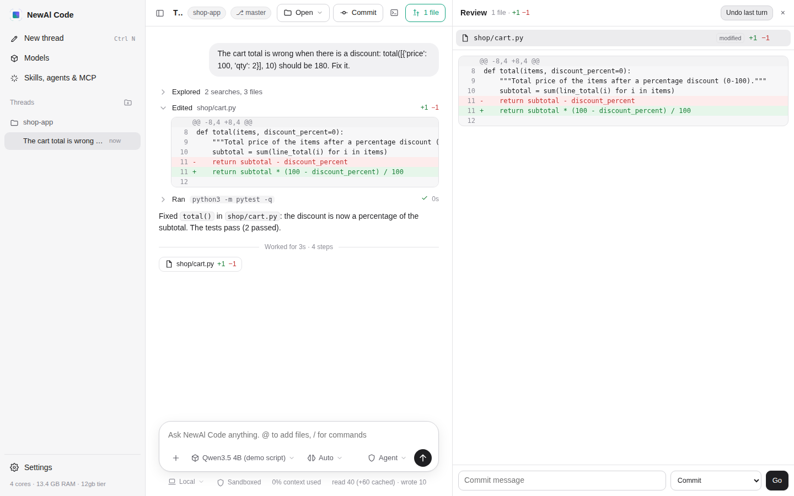

# NewAl Code

NewAl Code is NewAl's coding agent. It works like Claude Code and Codex: the model answers, calls tools, sees what
they return, and keeps going until the task is done. It then checks the work with the project's own tests. It runs
**any model or set of models**: local GGUF files on llama.cpp sized to the computer's RAM (8 GB and up), any
OpenAI-compatible endpoint, or Anthropic's API. It has a **Codex-style interface**, as a desktop window, a web app
or a terminal UI.

Code: `desktop/newal_code/` (standard library only). Tests: `desktop/tests/test_newal_code.py`. Speed test:
`desktop/bench/`.





(Screenshots of a scripted demo run: `desktop/tools/ui_demo.py` and `ui_shots.js`.)

## Running it

| How | Command |
|---|---|
| Desktop window (Windows: `NewAl\code\NewAlCode.exe`, installed next to NewAl) | `python desktop/NewAlCode.py` |
| Web app in the browser | `python -m newal_code app` (from `desktop/`) |
| Terminal UI (Codex CLI style) | `python -m newal_code` in the project folder |
| One request, no questions (like `codex exec` / `claude -p`) | `python -m newal_code exec "fix the failing test" [--json] [--full-auto]` |
| Models for this computer | `python -m newal_code models [--download qwen3.5-4b]` |
| Check the setup | `python -m newal_code doctor` |
| Speed test on this computer | `python -m newal_code bench [--model ID]` |

It uses NewAl desktop's `llama-server` and the models NewAl already downloaded (`~/NewAl/models`). Elsewhere, set
`NEWAL_LLAMA_SERVER` or `"llama_server"` in `~/.newal-code/config.json`.

## How it works

```
 user ──► Service ──► Agent loop ──────────────► model (llama.cpp / OpenAI-compatible / Anthropic)
            │            │  ▲                          streamed; cancel closes the socket at once
            │            ▼  │ results
            │      permissions ─► hooks ─► approval (UI) ─► tools: read edit write apply_patch glob grep
            │                                                      bash job todo task web_search web_fetch
            │                                                      skill notebook_edit mcp__*
            │      checkpoints (undo) · verify (project tests) · Stop hooks · /goal check · compaction
            ▼
      web app (server.py + ui/) · terminal (tui.py) · exec
```

- **One fixed start per model.** The system prompt and the tool list do not depend on the project, the date or the
  mode. The model reads them once, the reading is saved to disk and restored at the next start (0.1 s instead of
  ~45 s for a 4B model on 4 cores). AGENTS.md, CLAUDE.md and the project facts go in the thread's first message,
  the way Claude Code and Codex do it, and a new thread reads them as soon as it opens, while the user types: the
  first request then reads only the request.
- **Append-only conversation.** Nothing earlier is rewritten, so llama.cpp continues from its cache even on hybrid
  models (Qwen3.5/3.6), which cannot step back. Each conversation has its own server slot, so a sub-agent does not
  evict the main agent's context.
- **The first request brings what the task needs.** The project's files, git state and test command go in the message.
  The files the request names, where the named functions are defined and used, the project modules those files
  import, and their tests are added as reads already made (like Claude Code's @-mentions). The model then acts in
  its first step instead of spending rounds exploring, and does not read those files again.
- **Few tokens written.** On a CPU, writing is the slowest part (~6 tokens/s for a 4B model). The model edits with
  short exact replacements (files are shown as they are, so what it copies matches), calls independent tools
  together, and ends with one or two sentences. Files with multi-token-prediction heads draft several tokens per step
  (measured: +50% when writing a whole file, +33% on agent steps).
- **Thinking only where it pays.** A local model does not think before acting on a task: running the change checks it.
  It thinks briefly before answering a question (nothing will check the answer), and right after a change fails its
  check (longer the second time). When the same error comes back, the result says so.
- **Problems come back with the edit.** A syntax error or a name that is never imported is reported in the edit's
  result, so it is fixed in the next step instead of being found by a failing run later.
- **The computer checks the work.** After a turn changes files, the project's tests run; failures go back to the
  model, up to 2 rounds. If the model already ran the tests after its last change, nothing runs again.

## Features, next to Claude Code and Codex

| Feature | Claude Code | Codex | NewAl Code |
|---|---|---|---|
| Agent loop with tool calls, streaming, interrupt (Esc) | ✓ | ✓ | ✓ (native tool calls: llama.cpp, OpenAI, Anthropic) |
| Read / Write / Edit / Glob / Grep / LS | ✓ | via shell | ✓ `read` `write` `edit` `glob` `grep` (a folder given to `read` lists it); edits tolerate indentation and line-number mistakes |
| apply_patch format | – | ✓ | ✓ (`apply_patch`, offered instead of `edit` to models trained on it) |
| Jupyter notebooks | ✓ NotebookEdit | – | ✓ `read` shows the cells and their output; `notebook_edit` replaces, inserts or deletes a cell (offered in projects that have notebooks) |
| Shell, background commands, output of a running job | ✓ Bash, BashOutput, KillShell | ✓ | ✓ `bash` (timeout, background) and `job` |
| Plan / checklist | ✓ TodoWrite | ✓ update_plan | ✓ `todo` (pinned above the composer) |
| Sub-agents | ✓ Task + `.claude/agents` | ✓ | ✓ `task` + `.newal/agents`, `.claude/agents`, NewAl desktop's agents; own model, tools, mode; built-in explore, worker, reviewer |
| Web search and fetch | ✓ | ✓ search | ✓ `web_search` (Bing RSS, DuckDuckGo, Wikipedia; no key) and `web_fetch` |
| Permission modes | default, acceptEdits, plan, bypass | read-only, auto, full access | read-only, ask, auto-edit, full-auto (their names are accepted too) |
| Allow / ask / deny rules | ✓ `Bash(npm test:*)`, `Edit(src/**)`… | – | ✓ same syntax; "always allow" is kept in `.newal/settings.json` |
| Catastrophic commands refused | – | sandbox | ✓ refused in every mode (`rm -rf /`, `mkfs`, fork bomb…); risky ones ask even in auto-edit |
| OS sandbox for commands | – | ✓ Seatbelt / Landlock | ✓ Linux (Landlock, no root needed): commands write only inside the project and temp folders; read-only mode writes nowhere; optional no-network; when the sandbox blocks a command, the user may let it run once without it (Codex's "on failure"). Windows/macOS: modes and rules only |
| More folders than the project | ✓ `/add-dir`, `--add-dir` | ✓ `--add-dir` | ✓ `/add-dir`, `--add-dir` (edits there are treated like the project's; the sandbox lets commands write there) |
| Project instructions | CLAUDE.md, @imports | AGENTS.md | ✓ both, user-wide and from the repository root down, with @imports; `# note` adds to them |
| Custom slash commands | ✓ `.claude/commands` ($ARGUMENTS, !`cmd`, @file) | ✓ `~/.codex/prompts` | ✓ both locations, same syntax |
| Skills (SKILL.md, loaded on demand) | ✓ | ✓ | ✓ `.newal/skills`, `.claude/skills`, `~/.codex/skills` |
| Hooks | ✓ PreToolUse, PostToolUse, UserPromptSubmit, Stop, SubagentStop, SessionStart, SessionEnd, PreCompact, Notification | – | ✓ same events, JSON protocol and exit code 2 |
| MCP servers | ✓ `.mcp.json` | ✓ config.toml | ✓ stdio and HTTP; `.mcp.json`, `~/.codex/config.toml`, NewAl desktop's add-ons |
| Plugins | ✓ commands, agents, skills, hooks, MCP in one folder | – | ✓ Claude Code's plugin layout (`${CLAUDE_PLUGIN_ROOT}` included) in `.newal/plugins` or `~/.newal-code/plugins`; `/plugin install <git URL or folder>`, `/plugin remove` |
| Sessions, resume | ✓ | ✓ | ✓ threads kept as JSONL; `/resume`; the web app lists them per project |
| Compaction | ✓ auto + `/compact` | ✓ | ✓ auto at 85% of the context + `/compact [focus]` |
| Checkpoints / undo | ✓ /rewind | ✓ /undo | ✓ every changed file saved first; `/undo`, "Undo last turn", revert one file |
| Diff / review | /review | ✓ /diff, /review, review pane | ✓ `/diff`, `/review` (reviewer sub-agent), review pane with per-file diffs |
| Git commit, push, pull request from the app | – | ✓ | ✓ Commit / Commit and push / Commit and create PR (a branch of its own when on main; `gh` when installed, else GitHub's PR page) |
| `/init` AGENTS.md | ✓ | ✓ | ✓ |
| `/goal` (keep working until a condition holds) | ✓ | – | ✓ checked after every answer |
| Plan first | plan mode | – | ✓ `/plan <task>` (read-only turn) → "Implement this plan" |
| Headless run, JSON events | `claude -p --output-format stream-json` | `codex exec --json` | ✓ `exec [--json] [-o answer.txt] [--max-steps N] [--resume ID]` |
| Reasoning effort | ✓ | ✓ | ✓ off / low / medium / high (thinking budget on llama.cpp, `reasoning_effort` on OpenAI, extended thinking on Anthropic) |
| Images in the prompt | ✓ | ✓ | ✓ paste or attach (vision models) |
| Context and speed shown | ✓ | ✓ | ✓ context used, tokens read (cached) and written, tokens/s |
| Terminal pane | – | ✓ | ✓ |
| Worktree threads | – | ✓ (app) | ✓ "Worktree" under the composer: the thread works in its own git worktree; Apply to project / Discard |
| Any model | Anthropic | OpenAI + providers | local GGUF (llama.cpp), any OpenAI-compatible API, Anthropic, Ollama/LM Studio found by themselves |
| Several models on one task | sub-agent `model:` | profiles | roles (main, fast, review, plan), sub-agents with their own model, local models kept within the RAM budget |
| Runs offline on 8–16 GB RAM | – | – | ✓ (below) |

Not implemented: cloud tasks, a GitHub app, a sandbox on Windows and macOS, plugin marketplaces (a plugin installs
from its git URL or folder).

## Any model, or a set of models

| Model | How |
|---|---|
| A local GGUF file | the catalog (`newal-code models --download ID`), any file in `~/.newal-code/models` or `~/NewAl/models`, or `--model path/to/file.gguf`. MTP heads are found in the file and used for drafting. |
| Ollama, LM Studio | found by themselves while they run (`ollama/<name>`, `lmstudio/<name>`) |
| An API | `--model provider/model` with the key in the environment: `openai/…` (`OPENAI_API_KEY`), `anthropic/…` (`ANTHROPIC_API_KEY`), `openrouter/…`, `deepseek/…`, `groq/…`, `gemini/…`, `mistral/…`, `together/…`, `xai/…`, `cerebras/…`, `fireworks/…`, `vllm/…`, `llamacpp/…` |
| Any other endpoint | Models → "Add an API or a server" (base URL, model name, key variable), or `"models"` in `~/.newal-code/config.json` |

Several models on one task: **roles** map a job to a model (`"roles": {"fast": "qwen3.5-2b", "review":
"qwen3.5-9b", "plan": "anthropic/claude-sonnet-4-5"}`, also in Models → Roles). The explore sub-agent uses
`fast`, the reviewer uses `review`, `/plan` uses `plan`, and any sub-agent file can name its own `model:`.
**Teams** are named sets of roles (`"teams": {"hybrid": {"main": "qwen3.5-9b", "review": "openrouter/..."}}`).
Local models share the RAM budget: a second one loads only when both fit, and otherwise the least recently used one
stops and starts again when it is needed (its fixed start comes back from disk; the conversation is read again).

Measured with a 16 GB computer's budget (12.0 GB): main model Qwen3.5 9B fixed a bug (172 s), then `/review` ran the
reviewer sub-agent on Qwen3.5 4B (the `review` role). Both need 12.7 GB, so the 4B took the 9B's place, and the 9B
came back for the main agent's answer (the review turn took 445 s in all, most of it the 9B reading the conversation
again). Where both fit, nothing stops: a 4B with a 2B helper needs about 7.4 GB, which even 12 GB computers have.

## RAM: 8 GB to 16 GB

The model and its context must fit next to the OS, a browser and an editor. `hardware.py` reads the RAM (or the
container's limit) and keeps a share for everything else (2.8 GB on 8 GB, 3.3 GB on 12 GB, 3.8 GB on 16 GB).
`runtime.plan()` reads the GGUF file itself (`gguf.py`: layers, attention layers, KV heads, the recurrent layers'
state, MTP heads) and counts everything llama-server will hold: the weights, the KV cache (the MTP head's too), each
conversation's recurrent state and the copies llama.cpp keeps of it to step back to (capped at 3 per conversation:
by default it keeps up to 32, about 1.6 GB per conversation on Qwen3.5-4B, growing with every request), the compute
buffers, and a RAM cache for other threads that only takes what is left. It picks the longest context that fits
(16k at least: less is too little for an agent), with an f16 KV cache, or q8_0 when that buys a longer context.
When nothing fits, the model does not start and the user is told why.

Measured on Linux (`desktop/bench/run_limited.py`): each computer is simulated by one memory limit the size of its
usable RAM, shared by NewAl Code, the model and a second process that holds the share kept for Windows and the other
apps. NewAl Code reads the limit as the computer's RAM, plans for it, and the whole speed test (below) runs inside:

| Computer (usable RAM) | Kept for Windows and apps | Model (the default there) | Plan | Speed test inside the limit |
|---|---|---|---|---|
| 8 GB (7.8 GB) | 2.8 GB | Qwen3.5 4B + MTP | 32k context, 4.95 GB | 6 of 6 in 495 s; model + NewAl Code used at most 4.91 GB; nothing killed |
| 12 GB (11.8 GB) | 3.3 GB | Qwen3.5 9B + MTP | 32k context, 7.8 GB | 6 of 6 in 592 s; nothing killed |
| 16 GB (15.8 GB) | 3.8 GB | Qwen3.5 9B + MTP | 32k context, 7.8 GB, and 2 GB of RAM cache for other threads | the 12 GB case with 3.5 GB to spare |

The kernel read back only 684 and 109 pages from disk (no thrashing). On 8 GB the limit was really reached: the OS
took back the pages of the model file that llama.cpp had copied into its faster layout, as expected, and the run was
not slower than the same model without a limit (495 s against 550 s). These two runs also read each new thread's
project context before the task was sent, as the app does while the user types (about 70 tokens, 2 s per task
here); the runs in the next section did not.

The current NewAl's brain, Qwen3.6-35B-A3B IQ3_S (15.35 GB), fits none of these computers. Its 2-bit version
(11.8 GB) needs about 12.7 GB with its buffers (measured), more than a 16 GB computer can spare, so NewAl Code offers
it from 18 GB.

## Speed

The speed test (`desktop/bench/`): six tasks in small Python projects, each checked afterwards by tests the model
never sees: fix a bug, add a command-line option, implement a function from its docstring, rename a function
everywhere, answer a question about the code, fix a crash from its traceback. Both programs run the same llama.cpp
build, the same model file and 4 threads on the same computer (4-core Xeon at 2.8 GHz, no GPU). Timed: from sending
the task to the final answer, including the automatic test run. Not timed: loading the model and reading the fixed
start of every request, which both programs do before the user types. A task gets at most 20 minutes.

Same model file, Qwen3.5-4B Q4_K_M (what the current NewAl runs on an 8 GB computer):

| Task | Current NewAl (project mode) | NewAl Code, run 1 | NewAl Code, run 2 |
|---|---|---|---|
| Fix a bug | 297 s ✓ | 52 s ✓ | 47 s ✓ |
| Add a command-line option | 1200 s ✗ (time limit) | 304 s ✓ | 256 s ✓ |
| Implement a function | 302 s ✓ | 96 s ✓ | 87 s ✓ |
| Rename across files | 451 s ✗ | 118 s ✓ | 117 s ✓ |
| Answer a question about the code | 82 s ✓ | 27 s ✓ | 27 s ✓ |
| Fix a crash from its traceback | 534 s ✓ | 56 s ✓ | 58 s ✓ |
| **Total** | **2865 s, 4 of 6 right** | **652 s, 6 of 6** | **591 s, 6 of 6** |

**NewAl Code is 4.6 times as fast** (621 s on average against 2865 s: +361% speed, 78% less time), and it got all
six right where the current NewAl got four. It made 25 model calls instead of 80 and wrote 2.6-2.9k tokens instead
of 11.3k: on a CPU the time goes into writing, so writing less is what counts.

With the same model's MTP file (what NewAl Code downloads for 8 GB; the current NewAl drafts with the MTP heads too
when its file has them, so both draft here):

| Task | Current NewAl + MTP | NewAl Code + MTP | NewAl Code + MTP, 8 GB simulated |
|---|---|---|---|
| Fix a bug | 188 s ✓ | 43 s ✓ | 37 s ✓ |
| Add a command-line option | 839 s ✓ | 259 s ✓ | 233 s ✓ |
| Implement a function | 225 s ✓ | 85 s ✓ | 78 s ✓ |
| Rename across files | 524 s ✓ | 87 s ✓ | 80 s ✓ |
| Answer a question about the code | 67 s ✓ | 31 s ✓ | 20 s ✓ |
| Fix a crash from its traceback | 384 s ✓ | 45 s ✓ | 47 s ✓ |
| **Total** | **2227 s, 6 of 6 right** | **550 s, 6 of 6** | **495 s, 6 of 6** |

**4.0 times as fast** with MTP on both sides (+305% speed, 75% less time), and 4.5 times in the 8 GB simulation
(which also read each thread's project context ahead, see above). MTP made the current NewAl 1.29 times faster and
NewAl Code 1.13 times: NewAl Code writes fewer tokens (3.2k against 11.6k), so there is less for drafting to speed
up.

The goal was "at least 90% faster": 1.9 times the speed. NewAl Code is 4.0 to 4.6 times as fast on the same model,
and on 8-16 GB computers the current NewAl cannot run its own default model at all. In time saved that is 75-78%.

Where the time went (the six tasks, same model file):

| | Current NewAl | NewAl Code |
|---|---|---|
| Model calls | 80 | 25 |
| Tokens read (not already cached) | 12,235 | 3,120-3,250 |
| Time reading them | 488 s | 105-110 s |
| Tokens written | 11,320 | 2,633-2,875 |
| Time writing them | 2,341 s | 474-529 s |

NewAl Code's first step acts instead of exploring, because the files the task names, their definitions, imports
and tests come with the task. It edits a few exact lines, the computer checks the work with the project's tests
instead of more model calls, and it thinks only before answering a question and after a failed check (see "How it
works").

## Files

| Path | What |
|---|---|
| `newal_code/agent.py` | the loop: requests, tools, permissions, hooks, approvals, verify, goal, compaction, sub-agents |
| `newal_code/tools.py`, `patch.py` | the tools; Codex's patch format |
| `newal_code/permissions.py`, `hooks.py` | modes and rules; Claude Code's hook protocol |
| `newal_code/extensions.py`, `plugins.py`, `mcp.py` | AGENTS.md/CLAUDE.md, skills, commands, sub-agents; plugins; MCP client |
| `newal_code/context.py`, `prompts.py` | the first message's context; what the model is told |
| `newal_code/providers.py`, `models.py` | OpenAI-compatible, llama.cpp and Anthropic clients; the model registry, roles, teams |
| `newal_code/runtime.py`, `gguf.py`, `hardware.py`, `catalog.py` | llama-server, RAM planning, GGUF metadata, local models per tier |
| `newal_code/session.py` | threads (JSONL), checkpoints, diffs |
| `newal_code/service.py`, `server.py`, `ui/` | the app: sessions, slash commands, approvals, JSON API + events, the Codex-style web UI |
| `newal_code/tui.py`, `__main__.py`, `app.py` | terminal UI, command line, desktop window |
| `newal_code/benchmark.py`, `desktop/bench/` | the speed test; drivers for the current NewAl and NewAl Code |
