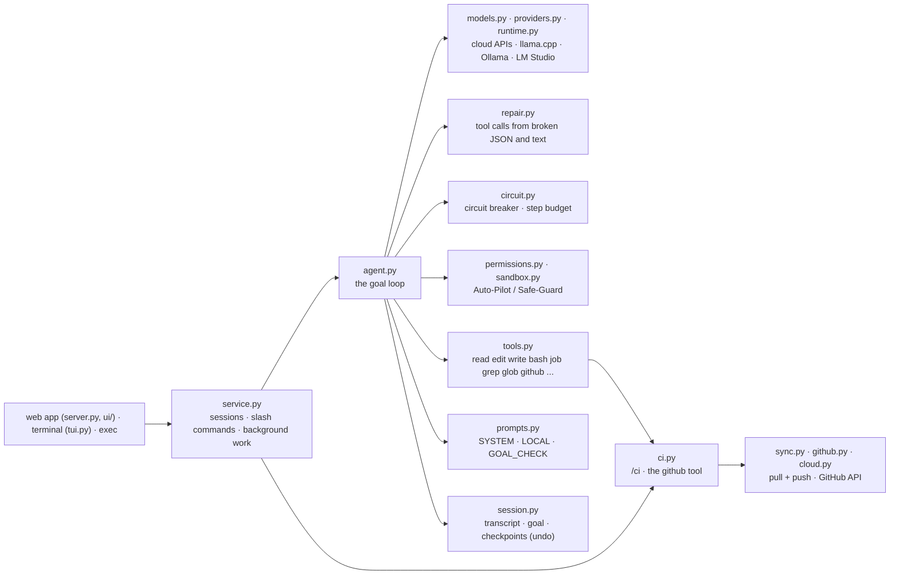
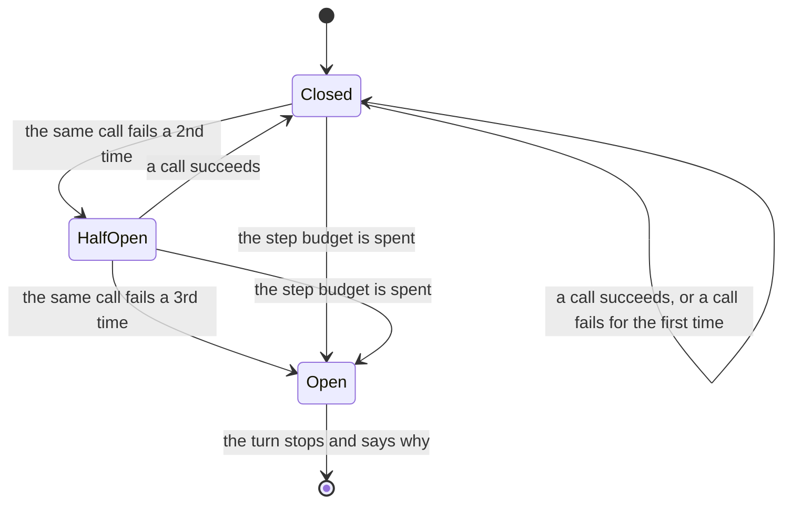

# OmniCode in NewAl Code

OmniCode's specification (a command-line agent like Claude Code and Codex, with cloud models and local models for
weak devices, a goal loop, terminal control, GitHub and CI self-repair) is built as NewAl Code
([desktop/newal_code](../desktop/newal_code)). Every line below is code that runs, with the test that runs it
(`desktop/tests/test_newal_code.py`), not instructions to a model.

- [The modules](#the-modules)
- [The goal loop](#the-goal-loop)
- [The circuit breaker](#the-circuit-breaker)
- [The system prompt for local models](#the-system-prompt-for-local-models)
- [Weak devices](#weak-devices)
- [GitHub and CI that fixes itself](#github-and-ci-that-fixes-itself)

## The modules



| OmniCode | Module | What runs | Test |
|---|---|---|---|
| Cloud models (Claude, OpenAI, DeepSeek...) | `providers.py`, `models.py` | Anthropic's Messages API; OpenAI-compatible presets `openai/`, `deepseek/`, `openrouter/`, `groq/`, `gemini/`, `mistral/`... | `ProviderTest` |
| Local models (llama.cpp, Ollama) | `runtime.py`, `models.py` | GGUF files on NewAl Code's own llama-server (RAM-planned context, saved prompt starts, MTP drafting); `ollama/`, `lmstudio/`, `llamacpp/` presets. `Client.on_device` marks all of them: the local prompt, 25 steps, tool calls read from text | `RamTest`, `CircuitTest` |
| Planner | `tools.py` (`todo`), `/plan` | a plan kept by the todo tool; `/plan` is a read-only turn (with the `plan` role's model when set) | `AgentLoopTest` |
| Executor | `agent.py` `_run_tools` | tool calls run in parallel when they only read, in order otherwise | `AgentLoopTest.test_parallel_reads_keep_order` |
| Verifier | `agent.py` `_tests_after_step`, `_verify` | the project's tests run by themselves after each step that changes files; failures go back with that step's result | `AgentLoopTest.test_tests_run_with_the_step_that_changed_files` |
| Evaluator and self-healing, goal % | `agent.py` `_goal_check`, `prompts.GOAL_CHECK` | after each answer: `DONE`, or `CONTINUE 40%: what is missing`, and the loop goes on; the % is kept in the session, shown in `/status` and the app | `OmniCodeTest.test_the_goal_has_a_percentage` |
| Auto-Pilot (YOLO) | `permissions.py` mode `full-auto` (`/mode yolo`, `/mode auto-pilot`) | nothing asks; catastrophic commands (`rm -rf /`, `mkfs`, a wiped disk) are still refused | `PermissionsTest` |
| Safe-Guard | `permissions.py` modes `auto-edit` (`/mode safe-guard`) and `ask` | `rm -rf`, `sudo`, `git push`, `git reset --hard`, package installs... ask first; the OS sandbox keeps commands inside the project | `PermissionsTest`, `SandboxTest` |
| Terminal: stdout, stderr, exit code | `tools.py` `bash` / `powershell` | output and exit code in each result; Ctrl+C stops everything the command started | `SandboxTest.test_cancel_stops_everything_the_command_started` |
| Background processes (PIDs, logs, stop) | `tools.py` `bash` with `background`, `job` | `job action=list` (ids and PIDs), `output`, `stop` by job id or PID; `/status` lists them | `OmniCodeTest.test_background_processes_by_pid_and_status` |
| Git: branches, commits, PRs | `server.py` commit menu, `github.py`, `sync.py`, `minigit.py` | commit / push / pull request (gh, or GitHub's API without gh); `/sync`; git on the phone | `GitHubTest`, `SyncTest`, `MiniGitTest` |
| CI self-repair (`gh run watch`) | `ci.py` | `/ci`: see [below](#github-and-ci-that-fixes-itself) | `CITest` |
| SEARCH/REPLACE diffs | `tools.py` `edit`, `repair.py` | `edit` is a search and replace (`old` → `new`); SEARCH/REPLACE blocks a model on this device writes as text are run as edits | `RepairTest.test_a_search_replace_block_edits_the_file` |
| Context pruning at 80% | `agent.py` `_prune_outputs`, `_maybe_compact` | old tool outputs become one line each, then a summary if still full | `PruneTest` |
| Circuit breaker (3 same failures, 25 steps) | `circuit.py` | see [below](#the-circuit-breaker) | `CircuitTest` |
| JSON / tool-call repair | `repair.py` | see [below](#weak-devices) | `RepairTest` |
| Tools `read_file_range`, `apply_diff`, `execute_terminal`, `manage_background_process`, `github_cli`, `search_codebase` | `tools.py`, `repair.py` | NewAl Code's `read` (offset, limit), `edit`, `bash`, `job`, `github`, `grep` / `glob` (ripgrep and fd when installed); OmniCode's names are accepted as aliases | `RepairTest`, `OmniCodeTest.test_ripgrep_and_the_python_search_agree` |
| `/goal`, `/model`, `/compact`, `/status` | `service.py` | the commands, in the app and the terminal | `ServerTest`, `OmniCodeTest` |

## The goal loop

`Agent.run` (agent.py) runs one request, or a goal, to its end:

```
request or /goal
   │
   ▼
┌► model call (one step: 25 a turn on this device, 60 with an API model)
│    │ tool calls: native, or repaired from the text (repair.py)
│    ▼
│  permissions (the mode) → hooks → the tool → its result
│    │ an edit step: the project's tests run and come back with the result
│    │ circuit breaker: 2nd identical failure → "change it"; 3rd → the turn stops, saying why
│    └──────────────────────────────────────────────────────────────────────────┐
│ no tool call = an answer                                                      │
│    ▼                                                                          │
│  the project's tests (verify) ─ fail → back to the model (2 rounds at most) ──┤
│    ▼                                                                          │
│  Stop hooks ─ block → back to the model ──────────────────────────────────────┤
│    ▼                                                                          │
│  goal check: DONE, or CONTINUE n%: what is missing → back to the model ───────┘
│    ▼
└─ the answer (the turn's changes listed; /undo reverts them)
```

## The circuit breaker

`circuit.py` stops a turn that is going nowhere, instead of spending a small model's steps (up to a minute each on a
phone) on the same mistake. A call is its tool and its arguments since the last file change: the same command after
an edit is a new try, not a repeat.



| State | When | What the model sees |
|---|---|---|
| Closed | normal work | the tool's result |
| Half-open | the same call failed a 2nd time with nothing changed | the result, then `(You made this exact call before and it failed the same way: change it, try another approach.)` |
| Open | the same call failed a 3rd time | the result, then `(Stopping: this exact call failed 3 times.)`; the turn ends with `Stopped: bash failed 3 times the same way (exit 1).` |
| Open | the step budget is spent | the turn ends with `Stopped after 25 steps without finishing.` |

- **What counts as failing:** a tool error, or a command (`bash`, `powershell`) whose exit code is not 0.
- **The step budget:** 25 model calls a turn for a model on this device (NewAl Code's llama.cpp, Ollama, LM Studio,
  a llama.cpp server, the phone's), 60 for an API model. `max_steps` in the settings (0: automatic) or a
  sub-agent's `steps` changes it.
- **A call that succeeds** but is made again with nothing changed gets a note from the 3rd time on: the result will
  not change.
- **Resets:** a call that succeeds closes a half-open breaker; each turn starts closed.
- **Where:** `Agent._one_tool` records every call (`Breaker.record`), `Agent.run` stops the turn when it is open;
  `/ci` does not commit or push a fix whose turn the breaker stopped.

## The system prompt for local models

A model on this device (`models.Client.on_device`) gets `prompts.LOCAL` as its system prompt; API models get
`prompts.SYSTEM`. LOCAL is SYSTEM with one rule more, which a small model on a weak device needs said outright: a
call that failed is changed before it is made again (the circuit breaker stops the turn at the third identical
failure) and a turn has a step budget. Everything else is SYSTEM's own words, measured on a 2B model (below): a
first version that also asked for reading long files in parts and worded edits as a search and replace did no
better. `{os}`, `{shell}` and `{steps}` are filled in once (the start stays the same for the whole session, so
llama.cpp reads it once and keeps it on disk):

<!-- the text of prompts.LOCAL (a test checks that they are the same) -->
```text
You are NewAl Code, a coding agent working in the user's project on their computer. Do the task with your tools, then reply.

Environment: {os}; shell: {shell}. The project folder, its files and the date come with the user's first message.

Rules:
- Act with tools right away; don't announce what you will do. Make independent tool calls together in one turn.
- Files shown in the conversation are current: don't read them again. Find other code with grep/glob, then read it.
- Change files with edit: old is only the few lines you change, copied exactly (never the whole file). Use write for new files or when you rewrite most of a file.
- Make the smallest change that fully does the task, in the project's style.
- Check your work. When the project has tests, they run by themselves after each step that changes files, and their result comes with that step; to see what a program prints, or when there are no tests, run it with bash. If something fails, fix it and check again.
- When an answer depends on what code computes (a value, an output), run the code with bash to get it; don't work it out in your head.
- A call that failed will fail again unchanged: change it, or try another way. The same failing call a third time ends your turn, and a turn has {steps} steps.
- Never claim something works unless a tool result showed it.
- Use todo only for tasks with three or more separate steps. Ask the user only if you cannot continue without them.
- Final reply: one short sentence saying what you changed and how you checked it; no code blocks, no lists. If the user asked a question, answer it directly. Use the user's language.
```

### Measured

On this computer's CPU (4 cores), with Qwen3.5-2B (Q4_K_M, a model for weak devices), on NewAl Code's six
speed-test tasks (`desktop/bench`: fix a bug, add a command-line option, write a function from its docstring, rename
a function across files, answer what code computes, fix a crash from its traceback), each checked by hidden tests.
Each round alternated the two prompts, three runs each (18 tasks per prompt):

| Round | The code | SYSTEM | LOCAL |
|---|---|---|---|
| 1 | the first LOCAL (long files read in parts, the edit worded as a search and replace, the breaker rule) | 10/18, 767 s | 8/18, 781 s¹ |
| 2 | LOCAL = SYSTEM + the breaker rule | 6/18, 1653 s | 9/18, 653 s |
| 3 | the same, with a cut-off call no longer run (below) | 8/18, 773 s | 9/18, 713 s |

¹ Without a 1200 s hang of the tool runner, fixed since: the model ran the task's `server.py` to find its port, and
the command's output stayed open.

The same prompt varies from run to run (SYSTEM passed 10, 6 and 8 of 18: the model samples at temperature 0.2); on the
same code, LOCAL was never behind SYSTEM (18/36 against 14/36 in rounds 2 and 3, in 1366 s against 2426 s). No
version answered the question task (8000 + 80: the 2B model answers 880 without running the code) or the command-line
option task.

These runs found what the unit tests had not, all fixed: a command that left a program running made the turn wait
forever; a call cut off at the output limit (a runaway edit of 4096 tokens) was half applied, and its arguments made
llama.cpp refuse every later request of the thread (HTTP 500); the settings' default of 60 steps overrode the 25 of
a model on this device - a rename that went nowhere used all 60 steps (720 s) before, and stops at 25 now.

What else a local model gets, in code rather than in words:

- **The tools as tool definitions**, read once with the prompt. A model under 1.5 GB (a phone's) gets only `read`,
  `edit`, `write` and `bash` (and `phone` on a phone), and paths relative to the project: tiny models copy long
  absolute paths badly.
- **The project in the first message**: AGENTS.md / CLAUDE.md, the files, git's state, the test command, and the
  files the request names (with their definitions, imports and tests) as reads already made.
- **No reminder after the request.** `(When done, reply in one sentence.)` at the end of the message made
  Qwen2.5-Coder 1.5B (on a phone) reply at once that it had done the task, with no tool call: 0 of 12 requests
  (a file in Arabic, opening WhatsApp) made a call with it, 12 of 12 without it. Qwen3.5-2B's speed test did better
  without it too: 8 of 12 tasks in 290 s, against 9 of 18 in 713 s with it (round 3 above).
- **A claim with nothing done is caught.** A reply that says something was created, opened or fixed in a turn that
  used no tool gets "Nothing was done: no tool was used in this turn. Do it now with the tools (...)"; still only
  said, the user is told plainly: "Nothing was done in this turn: the model used no tool."
- **No thinking before acting** on a task (running the change checks it); a short think before answering a question
  and after a failed check.
- **Tool calls read from the text too** (`repair.py`, loose mode): a bare JSON object naming a tool and ReAct's
  `Action:` lines count, besides `<tool_call>`, `<function=...>`, `[TOOL_CALLS]`, json blocks and SEARCH/REPLACE
  blocks.

`local_prompt: false` in the settings gives local models SYSTEM instead.

## Weak devices

- **SEARCH/REPLACE diffs.** `edit` takes the few lines to change (`old`) and their replacement (`new`), never the
  whole file; an edit's result reports a syntax error or a name never imported at once. A model that writes Aider's
  SEARCH/REPLACE blocks into its answer instead of calling a tool (a model on this device) gets them run as edits,
  when the file exists:

  ```text
  calc.py
  <<<<<<< SEARCH
      return a - b
  =======
      return a + b
  >>>>>>> REPLACE
  ```

- **Context pruning at 80%.** When a request fills 80% of the context (`auto_compact`), old tool outputs give way to
  one line each - `[Terminal output pruned: exit 0]`, `[File content pruned: read it again if you need it]`,
  `[Search results pruned: search again if you need them]` - and the latest 6 stay whole. Only if that is not enough
  is the conversation summarized. The pruned conversation is saved (a resumed thread stays pruned).
- **Circuit breaker.** [Above](#the-circuit-breaker): 3 identical failures stop the turn; 25 steps a turn.
- **JSON and tool-call repair.** Arguments that are not quite JSON (single quotes, trailing commas, Python's
  `True`/`False`/`None`, raw line breaks in strings, a missing closing quote or brace, a code fence) are repaired;
  a model on this device gets the calls it wrote into its text made into calls (an API model makes its calls
  itself, so a call it shows as an example stays text); other agents' names become NewAl Code's (`apply_diff` → `edit`,
  `execute_terminal` → `bash`, `read_file_range` → `read`, `search_codebase` → `grep`,
  `manage_background_process` → `job`, `github_cli` → `github`; `file_path` → `path`, `old_string` → `old`,
  `start_line`/`end_line` → `offset`/`limit`...). Only calls to the thread's tools are made, and a code example in
  an answer stays text. An argument name is only renamed for a tool that takes the new name and not the old one
  (the phone's `name` and `text` stay theirs).
- **ripgrep and fd.** `grep` and file listing use them when they are installed, with the same results as the
  built-in search, which stays the fallback: `node_modules`, build output and hidden folders are skipped, `.github`
  is searched.

## GitHub and CI that fixes itself

`/ci [tries]` (ci.py), in the app, the terminal, or without an interface (`newal-code exec "/ci"`, exit code 0 when
green):

```
/ci ─► HEAD on GitHub? (else /sync pushes it) ─► watch the runs of HEAD ─────────────────► all green: done
                                                    ▲              │ a job failed
                                                    │              ▼
                               push (/sync) ◄─ commit ◄─ the agent fixes it ◄─ the failed step's log (the error)
```

- **Watching** is what `gh run watch` does, through GitHub's API (no gh needed; the phone too): the commit's
  workflow runs, every 15 s, until all have ended.
- **The log** of each failed job: the failed step's command and the end of its output (where test runners and
  compilers print the error), without GitHub's time stamps and colors. A run that failed before any job points at
  its workflow file.
- **The fix** is an agent turn with that log. The agent is told to run the failing command itself first and never to
  skip, disable or delete a test. Its change is committed as `Fix CI: <workflow> / <job>` with the agent's one
  sentence, and pushed: only the files it changed and files that were clean before `/ci`; the user's own
  uncommitted work stays out.
- **It stops** when CI is green, after its tries (3; `/ci 5` gives 5), when a fix did not finish (nothing half-done
  is pushed), when nothing was changed, or in read-only mode (it reports the failure and fixes nothing).

The `github` tool, offered in projects whose origin is on GitHub: `runs` (this branch's latest runs), `run` (a run's
jobs and failed steps), `logs` (the failed jobs' logs), `rerun` (the failed jobs again), `prs`, `pr`, `issues`,
`issue`, `comment`, `create_pr`. Looking is allowed in every mode; `rerun`, `comment` and `create_pr` ask first
unless the mode is full-auto (a rule like `GitHub(rerun)` allows one for good).
